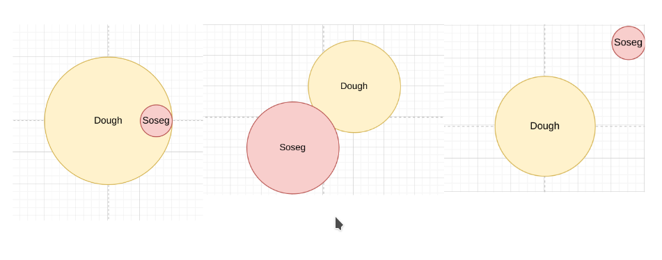

# Pizza and Sosig
english version -> click [here](index.html)
Arshad adalah seorang chef pizza di Vecashee. Hari ini dia mau membuat pizza

Dia mulai dengan membuat adonan pizzanya menjadi lingkaran sempurna dengan diameter $D_{pizza}$ dan meletakannya pada suatu koordinat kartesius.

Sekarang dia ingin menaruh Sosig (sosis) dengan diameter $D_{sosig}$ pada adonannya. Arshad ingin melakukan hal ini dengan style. Dia memilih koordinat acak, kemudian melempar sosignya kesana. Dia ingin tahu terlebih dahulu apakah sosig itu akan mendarat pada adonannya, sebagian pada adonannya, atau tidak mendarat pada adonan sama sekali.

Arshad adalah seorang perfeksionis dan penembak jitu yang handal. Adonan pizza yang dia buat, dan sosig yang dia pakai merupakan lingkaran sempurna. Lemparan Arshad juga tidak pernah meleset.

> Note
> Jika adonan dan sosig hanya bertemu pada kelilingnya, maka dianggap sosignya tidak mendarat pada adonan.
## Input Format
Input berisi 6 bilangan real yang dipisahkan oleh spasi dengan urutan sebagai berikut:

$D_{pizza}$ $D_{sosig}$ $X_{pizza}$ $Y_{pizza}$ $X_{sosig}$ $Y_{sosig}$

$D_{pizza}$ merupakan diameter adonan pizza
$D_{sosig}$ merupakan diameter sosig
$X_{pizza}$ $Y_{pizza}$ merupakan koordinat pusat dari adonan pizza
$X_{sosig}$ $Y_{sosig}$ merupakan koordinat pusat dari target sosig. 

## Output Format
Anda harus menentukan apakah sosignya akan mendarat pada adonan, sebagian pada adonan, atau tidak sama sekali

Jika sosignya akan mendarat pada adonan, outputkan:
```
Finally, some good f-ing good
```
Jika sosignya akan mendarat sebagian pada adonan, outputkan:
```
You Idiot
```
jika sosignya tidak mendarat pada adonan sama sekali, outputkan:
```
You Idiot Sandwich
```

## Examples
#### Input 1
```
4 1 0 0 1.5 0
```
#### Output 1
```
Finally, some good f-ing good
```
#### Input 2
```
3 3 1 1 -1 -1 
```
#### Output 2
```
You Idiot
```

#### Input 3
```
3 1 0 0 2.5 2.5
```
#### Output 3
```
You Idiot Sandwich
```

Gambar di bawah ini merepresentasikan input 1, 2, dan 3 secara berurut.


